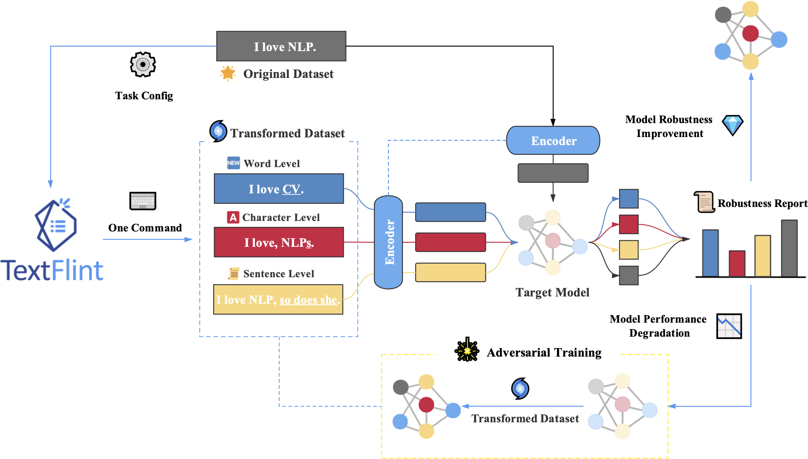
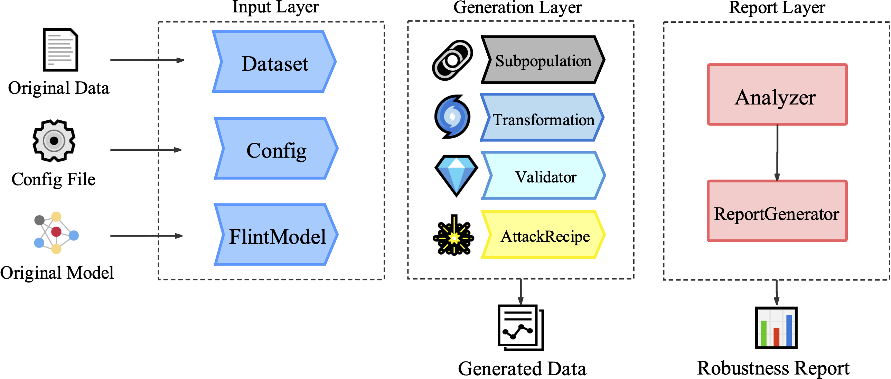

<p align="center"></p>

<p align="center">Unified Multilingual Robustness Evaluation Toolkit 
    for Natural Language Processing</p>
<p align="center">
  <a href="https://textflint.readthedocs.io/">[TextFlint Documentation on ReadTheDocs]</a> 
  <br> <br>
  <a href="#about">About</a> •
  <a href="#setup">Setup</a> •
  <a href="#usage">Usage</a> •
  <a href="#design">Design</a> 
  <br> <br>
  <a target="_blank">
    
  </a>
  <a href="https://badge.fury.io/py/textattack">
    
  </a>
</p>


## About


TextFlint is a multilingual robustness evaluation platform for natural language processing tasks, which unifies general text transformation, task-specific transformation, adversarial attack, sub-population, and their combinations to provide a comprehensive robustness analysis.

### Features:

There are lots of reasons to use TextFlint:

- **Full coverage of transformation types**, including 20 general transformations, 8 subpopulations and 60 task-specific transformations, as well as thousands of their combinations, which basically covers all aspects of text transformations to comprehensively evaluate the robustness of your model. TextFlint also supports adversarial attack to generate model specific transformed datas.
- **Generate targeted augmented data**, and you can use the additional data to train or fine-tune your model to improve your model's robustness.
- **Provide a complete analytical report automatically** to accurately explain where your model's shortcomings are, such as the problems in syntactic rules or syntactic rules. 

## Setup

### Installation

You can either use `pip` or clone this repo to install TextFlint.

1. **Using `pip` (recommended)**

```shell
pip install TextFlint
```

2. **Cloning this repo**

```shell
git clone https://github.com/textflint/textflint.git
cd TextFlint
python setup.py install
```

## Usage
### Workflow




The general workflow of TextFlint is displayed above. Evaluation of target models could be devided into three steps:

1. For input preparation, the original dataset for testing, which is to be loaded by `Dataset`, should be firstly formatted as a series of `JSON` objects. TextFlint configuration is specified by `Config`. Target model is also loaded as `FlintModel`. 
2. In adversarial sample generation, multi-perspective transformations (i.e., `Transformation`,`Subpopulation` and `AttackRecipe`), are performed on `Dataset` to generate transformed samples. Besides, to ensure semantic and grammatical correctness of transformed samples, `Validator` calculates confidence of each sample to filter out unacceptable samples. 
3. Lastly, `Analyzer` collects evaluation results and `ReportGenerator` automatically generates a comprehensive report of model robustness. 

### Quick Start

The following code snippet shows how to generate transformed data on the Sentiment Analysis task.

```python
from TextFlint.engine import Engine
from TextFlint.input_layer.config import Config

# load the data samples
sample1 = {'x': 'Titanic is my favorite movie.', 'y': 'pos'}
sample2 = {'x': 'I don\'t like the actor Tim Hill', 'y': 'neg'}
data_samples = [sample1, sample2]

# define the transformation/subpopulation/attack types in the json config file
config = Config.from_json_file("TextFlint/common/config_files/SA/SA.json")

# define the output directory
out_dir_path = './test_result/'

# run transformation/subpopulation/attack and save the transformed data to out_dir_path in json format
engine = Engine('SA')
engine.run(data_samples, out_dir_path, config)
```

You can also feed data to `TextFlintEngine` in other ways (e.g., `json` or `csv`) where one line represents for a sample. We have defined some transformations and subpopulations in `SA.json`, and you can also pass your own  configuration file as you need.

####  Transformed Datasets

After transformation, here are the contents in `./test_result/`:

```
ori_AddEntitySummary-movie_1.json
ori_AddEntitySummary-person_1.json
trans_AddEntitySummary-movie_1.json
trans_AddEntitySummary-person_1.json
...
```

where the `trans_AddEntitySummary-movie_1.json`  contains `1` successfully transformed sample by transformation `AddEntitySummary` and `ori_AddEntitySummary-movie_1.json` contains the corresponding original sample. The content in `ori_AddEntitySummary-movie_1.json`: 

```
{'x': 'Titanic is my favorite movie.', 'y': 'pos', "sample_id": 0}
```
The content in `trans_AddEntitySummary-movie_1.json`:
```
{"x": "Titanic (A seventeen-year-old aristocrat falls in love with a kind but poor artist aboard the luxurious, ill-fated R.
M.S. Titanic .) is my favorite movie.", "y": "pos", "sample_id": 0}
```

## Design



### Architecture

***Input layer:*** receives textual datasets and models as input, represented as `Dataset` and `FlintModel` separately.

- **`DataSet`**: a container for `Sample`, provides efficiently and handily operation interfaces for `Sample`. `Dataset` supports loading, verification, and saving data in Json or CSV format for various NLP tasks. 
- **`FlintModel`**: a target model used in an adversarial attack.

 ***Generation layer:***  there are mainly four parts in generation layer:

- **`Subpopulation`**: generates a subset of a `DataSet`. 
- **`Transformation`**: transforms each sample of `Dataset` if it can be transformed. 
- **`AttackRecipe`**: attacks the `FlintModel` and generate a `DataSet` of adversarial examples.
- **`Validator`**: verifies the quality of samples generated by `Transformation` and `AttackRecipe`.

***Report layer:*** analyzes model testing results and provides robustness report for users.

### Transformation

In order to verify the robustness comprehensively, TextFlint offers 20 universal transformations and 60 task-specific transformations, covering 12 NLP tasks. The following table summarizes the `Transformation` currently supported and the examples for each transformation can be found in our [web site](https://www.textflint.com).

<div style="overflow-x: auto; overflow-y: auto; height: 1000px; width:100%;">
<table style="width:100%" border="2">
<thead>
  <tr>
    <th>Task</th>
    <th>Transformation</th>
    <th>Description</th>
    <th>Reference</th>
  </tr>
</thead>
<tbody >
  <tr>
    <td rowspan="20">UT (Universal Transformation)</td>
      <td><code>AppendIrr</code></td>
      <td><sub>Extend sentences by irrelevant sentences</sub></td>
    <td>-</td>
  </tr>
  <tr>
      <td><code>BackTrans</code></td>
      <td><sub>BackTrans (Trans short for translation) replaces test data with paraphrases by leveraging back translation, which is able to figure out whether or not the target models merely capture the literal features instead of semantic meaning. </sub></td>
    <td>-</td>
  </tr>
  <tr>
      <td><code>Contraction</code></td>
      <td><sub>Contraction replaces phrases like `will not` and `he has` with contracted forms, namely, `won’t` and `he’s`</sub></td>
    <td>-</td>
  </tr>
  <tr>
    <td><code>InsertAdv</code></td>
    <td><sub>Transforms an input by add adverb word before verb</sub></td>
    <td>-</td>
  </tr>
  <tr>
    <td><code>Keyboard</code></td>
      <td><sub>Keyboard turn to the way how people type words and change tokens into mistaken ones with errors caused by the use of keyboard, like `word → worf` and `ambiguous → amviguius`.</sub></td>
    <td>-</td>
  </tr>
  <tr>
    <td><code>MLMSuggestion</code></td>
    <td><sub>MLMSuggestion (MLM short for masked language model) generates new sentences where one syntactic category element of the original sentence is replaced by what is predicted by masked language models.</sub></td>
    <td>-</td>
  </tr>
  <tr>
    <td><code>Ocr</code></td>
    <td><sub>Transformation that simulate ocr error by random values.</sub></td>
    <td>-</td>
  </tr>
  <tr>
    <td><code>Prejudice</code></td>
    <td><sub>Transforms an input by Reverse gender or place names in sentences.</sub></td>
    <td>-</td>
  </tr>
  <tr>
    <td><code>Punctuation</code></td>
    <td><sub>Transforms input by add punctuation at the end of sentence.</sub></td>
    <td>-</td>
  </tr>
  <tr>
    <td><code>ReverseNeg</code></td>
    <td><sub>Transforms an affirmative sentence into a negative sentence, or vice versa.</sub></td>
    <td>-</td>
  </tr>
  <tr>
    <td><code>SpellingError</code></td>
    <td><sub>Transformation that leverage pre-defined spelling mistake dictionary to simulate spelling mistake.</sub></td>
    <td><sub>Text Data Augmentation Made Simple By Leveraging NLP Cloud APIs (https://arxiv.org/ftp/arxiv/papers/1812/1812.04718.pdf)</sub></td>
  </tr>
  <tr>
    <td><code>SwapAntWordNet</code></td>
    <td><sub>Transforms an input by replacing its words with antonym provided by WordNet.</sub></td>
    <td>-</td>
  </tr>
  <tr>
    <td><code>SwapNamedEnt</code></td>
    <td><sub>Swap entities with other entities of the same category. </sub></td>
    <td>-</td>
  </tr>
  <tr>
    <td><code>SwapNum</code></td>
    <td><sub>Transforms an input by replacing the numbers in it.</sub></td>
    <td>-</td>
  </tr>
  <tr>
    <td><code>SwapSynWordEmbedding</code></td>
    <td><sub>Transforms an input by replacing its words by Glove.</sub></td>
    <td>-</td>
  </tr>
  <tr>
    <td><code>SwapSynWordNet</code></td>
    <td><sub>Transforms an input by replacing its words with synonyms provided by WordNet. </sub></td>
    <td>-</td>
  </tr>
  <tr>
    <td><code>Tense</code></td>
    <td><sub>Transforms all verb tenses in sentence.</sub></td>
    <td>-</td>
  </tr>
  <tr>
    <td><code>TwitterType</code></td>
    <td><sub>Transforms input by common abbreviations in TwitterType.</sub></td>
    <td>-</td>
  </tr>
  <tr>
    <td><code>Typos</code></td>
      <td><sub>Randomly inserts, deletes, swaps or replaces a single letter within one word (Ireland → Irland).</sub></td>
      <td><sub>Synthetic and noise both break neural machine translation (https://arxiv.org/pdf/1711.02173.pdf)</sub></td>
  </tr>
  <tr>
    <td><code>WordCase</code></td>
      <td><sub>Transform an input to upper and lower case or capitalize case.</sub></td>
    <td>-</td>
  </tr>    
  <tr>
    <td rowspan="7">RE (Relation Extraction)</td>
      <td><code>InsertClause</code></td>
      <td><sub>InsertClause is a transformation method which inserts entity description for head and tail entity</sub></td>
    <td>-</td>
  </tr>
  <tr>
    <td><code>SwapEnt-LowFreq</code></td>
      <td><sub>SwapEnt-LowFreq is a sub-transformation method from EntitySwap which replace entities in text with random same typed entities with low frequency.</sub></td>
    <td>-</td>
  </tr>
  <tr>
      <td><code>SwapTriplePos-Birth</code></td>
      <td><sub>SwapTriplePos-Birth is a transformation method specially designed for birth relation. It paraphrases the sentence and keeps the original birth relation between the entity pairs.</sub></td>
    <td>-</td>
  </tr>
  <tr>
      <td><code>SwapTriplePos-Employee</code></td>
      <td><sub>SwapTriplePos-Employee is a transformation method specially designed for employee relation. It deletes the TITLE description of each employee and keeps the original employee relation between the entity pairs.</sub></td>
    <td>-</td>
  </tr>
  <tr>
      <td><code>SwapEnt-SamEtype</code></td>
      <td><sub>SwapEnt-SamEtype is a sub-transformation method from EntitySwap which replace entities in text with random entities with the same type.</sub></td>
    <td>-</td>
  </tr>
  <tr>
      <td><code>SwapTriplePos-Age</code></td>
      <td><sub>SwapTriplePos-Age is a transformation method specially designed for age relation. It paraphrases the sentence and keeps the original age relation between the entity pairs.</sub></td>
    <td>-</td>
  </tr>
  <tr>
      <td><code>SwapEnt-MultiType</code></td>
      <td><sub>SwapEnt-MultiType is a sub-transformation method from EntitySwap which replace entities in text with random same-typed entities with multiple possible types.</sub></td>
    <td>-</td>
  </tr>
  <tr>
    <td rowspan="5">NER (Named Entity Recognition)</td>
      <td><code>EntTypos</code></td>
      <td><sub>Swap/delete/add random character for entities</sub></td>
    <td>-</td>
  </tr>
  <tr>
      <td><code>ConcatSent</code></td>
      <td><sub>Concatenate sentences to a longer one.</sub></td>
    <td>-</td>
  </tr>
  <tr>
      <td><code>SwapLonger</code></td>
      <td><sub>Substitute short entities to longer ones</sub></td>
    <td>-</td>
  </tr>
  <tr>
      <td><code>CrossCategory</code></td>
      <td><sub>Entity Swap by swaping entities with ones that can be labeled by different labels.</sub></td>
    <td>-</td>
  </tr>
  <tr>
    <td><code>OOV</code></td>
    <td><sub>Entity Swap by OOV entities.</sub></td>
    <td>-</td>
  </tr>
  <tr>
    <td rowspan="5">POS (Part-of-Speech  Tagging)</td>
    <td><code>SwapMultiPOSRB</code></td>
    <td><sub>It is implied by the phenomenon of conversion that some words hold multiple parts of speech. That is to say, these multi-part-of-speech words might confuse the language models in terms of POS tagging. Accordingly, we replace adverbs with words holding multiple parts of speech.</sub></td>
    <td>-</td>
  </tr>
  <tr>
    <td><code>SwapPrefix</code></td>
    <td><sub>Swapping the prefix of one word and keeping its part of speech tag.</sub></td>
    <td>-</td>
  </tr>
  <tr>
    <td><code>SwapMultiPOSVB</code></td>
    <td><sub>It is implied by the phenomenon of conversion that some words hold multiple parts of speech. That is to say, these multi-part-of-speech words might confuse the language models in terms of POS tagging. Accordingly, we replace verbs with words holding multiple parts of speech.</sub></td>
    <td>-</td>
  </tr>
  <tr>
    <td><code>SwapMultiPOSNN</code></td>
    <td><sub>It is implied by the phenomenon of conversion that some words hold multiple parts of speech. That is to say, these multi-part-of-speech words might confuse the language models in terms of POS tagging. Accordingly, we replace nouns with words holding multiple parts of speech.</sub></td>
    <td>-</td>
  </tr>
  <tr>
    <td><code>SwapMultiPOSJJ</code></td>
    <td><sub>It is implied by the phenomenon of conversion that some words hold multiple parts of speech. That is to say, these multi-part-of-speech words might confuse the language models in terms of POS tagging. Accordingly, we replace adjectives with words holding multiple parts of speech.</sub></td>
    <td>-</td>
  </tr>
  <tr>
    <td rowspan="6">COREF (Coreference Resolution)</td>
    <td><code>RndConcat</code></td>
    <td><sub>RndConcat is a task-specific transformation of coreference resolution, this transformation will randomly retrieve an irrelevant paragraph from the corpus, and concatenate it after the original document</sub></td>
    <td>-</td>
  </tr>
  <tr>
    <td><code>RndDelete</code></td>
    <td><sub>RndDelete is a task-specific transformation of coreference resolution, through this transformation, there is a possibility (20% by default) for each sentence in the original document to be deleted, and at least one sentence will be deleted; related coreference labels will also be deleted</sub></td>
     <td>-</td>
    </tr>
  <tr>
    <td><code>RndReplace</code></td>
    <td><sub>RndInsert is a task-specific transformation of coreference resolution, this transformation will randomly retrieve irrelevant sentences from the corpus, and replace sentences from the original document with them （the proportion of replaced sentences and original sentences is 20% by default）</sub></td>
    <td>-</td>
  </tr>
  <tr>
    <td><code>RndShuffle</code></td>
    <td><sub>RndShuffle is a task-specific transformation of coreference resolution, during this transformation, a certain number of swapping will be processed, which swap the order of two adjacent sentences of the original document （the number of swapping is 20% of the number of original sentences by default）</sub></td>
    <td>-</td>
  </tr>
  <tr>
    <td><code>RndInsert</code></td>
    <td><sub>RndInsert is a task-specific transformation of coreference resolution, this transformation will randomly retrieve irrelevant sentences from the corpus, and insert them into the original document （the proportion of inserted sentences and original sentences is 20% by default）</sub></td>
    <td>-</td>
  </tr>
  <tr>
    <td><code>RndRepeat</code></td>
    <td><sub>RndRepeat is a task-specific transformation of coreference resolution, this transformation will randomly pick sentences from the original document, and insert them somewhere else in the document （the proportion of inserted sentences and original sentences is 20% by default）</sub></td>
    <td>-</td>
  </tr>
  <tr>
    <td rowspan="3">ABSA (Aspect-based Sentiment Analysis)</td>
    <td><code>RevTgt</code></td>
    <td><sub>RevTgt: reverse the sentiment of the target aspect.</sub></td>
      <td rowspan="3"><sub>Tasty Burgers, Soggy Fries: Probing Aspect Robustness in Aspect-Based Sentiment Analysis (https://www.aclweb.org/anthology/2020.emnlp-main.292.pdf)</sub></td>
  </tr>
  <tr>
    <td><code>AddDiff</code></td>
    <td><sub>RevNon: Reverse the sentiment of the non-target aspects with originally the same sentiment as target.</sub></td>
  </tr>
  <tr>
    <td><code>RevNon</code></td>
    <td><sub>AddDiff: Add aspects with the opposite sentiment from the target aspect.</sub></td>
  </tr>
  <tr>
    <td rowspan="5">CWS (Chinese Word Segmentation)</td>
    <td><code>SwapContraction</code></td>
    <td><sub>SwapContriction is a task-specific transformation of Chinese Word Segmentation, this transformation will replace some common abbreviations in the sentence with complete words with the same meaning</sub></td>
    <td>-</td>
  </tr>
  <tr>
    <td><code>SwapNum</code></td>
    <td><sub>SwapNum is a task-specific transformation of Chinese Word Segmentation, this transformation will replace the numerals in the sentence with other numerals of similar size</sub></td>
    <td>-</td>
  </tr>
  <tr>
    <td><code>SwapSyn</code></td>
    <td><sub>SwapSyn is a task-specific transformation of Chinese Word Segmentation, this transformation will replace some words in the sentence with some very similar words</sub></td>
    <td>-</td>
  </tr>
  <tr>
    <td><code>SwapName</code></td>
    <td><sub>SwapName is a task-specific transformation of Chinese Word Segmentation, this transformation will replace the last name or first name of the person in the sentence to produce some local ambiguity that has nothing to do with the sentence</sub></td>
    <td>-</td>
  </tr>
  <tr>
    <td><code>SwapVerb</code></td>
    <td><sub>SwapName is a task-specific transformation of Chinese Word Segmentation, this transformation will transform some of the verbs in the sentence to other forms in Chinese</sub></td>
    <td>-</td>
  </tr>
  <tr>
    <td rowspan="3">SM (Semantic Matching)</td>
    <td><code>SwapWord</code></td>
    <td><sub>This transformation will add some meaningless sentence to premise, which do not change the semantics.</sub></td>
    <td>-</td>
  </tr>
  <tr>
    <td><code>SwapNum</code></td>
    <td><sub>This transformation will find some num words in sentences and replace them with different num word.</sub></td>
    <td>-</td>
  </tr>
  <tr>
    <td><code>Overlap</code></td>
    <td><sub>This method generate some data by some template, whose hypotheis and sentence1 have many overlap but different meaning.</sub></td>
    <td>-</td>
  </tr>
  <tr>
    <td rowspan="5">SA (Sentiment Analysis)</td>
    <td><code>SwapSpecialEnt-Person</code></td>
    <td><sub>SpecialEntityReplace-Person is a task-specific transformation of sentiment analysis, this transformation will identify some special person name in the sentence, randomly replace it with other entity names of the same kind</sub></td>
    <td>-</td>
  </tr>
  <tr>
    <td><code>SwapSpecialEnt-Movie</code></td>
    <td><sub>SpecialEntityReplace is a task-specific transformation of sentiment analysis, this transformation will identify some special movie name in the sentence, randomly replace it with other movie name.</sub></td>
    <td>-</td>
  </tr>
  <tr>
    <td><code>AddSum-Movie</code></td>
    <td><sub>AddSummary-Movie is a task-specific transformation of sentiment analysis, this transformation will identify some special movie name in the sentence, and insert the summary of these entities after them (the summary content is from wikipedia).</sub></td>
    <td>-</td>
  </tr>
  <tr>
    <td><code>AddSum-Person</code></td>
    <td><sub>AddSummary-Person is a task-specific transformation of sentiment analysis, this transformation will identify some special person name in the sentence, and insert the summary of these entities after them (the summary content is from wikipedia).</sub></td>
    <td>-</td>
  </tr>
  <tr>
    <td><code>DoubleDenial</code></td>
    <td><sub>SpecialWordDoubleDenial is a task-specific transformation of sentiment analysis, this transformation will find some special words in the sentence and replace them with double negation</sub></td>
    <td>-</td>
  </tr>
  <tr>
    <td rowspan="4">NLI (Natural Language Inference)</td>
    <td><code>NumWord</code></td>
    <td><sub>This transformation will find some num words in sentences and replace them with different num word.</sub></td>
    <td rowspan="3"><sub>Stress Test Evaluation for Natural Language Inference (https://www.aclweb.org/anthology/C18-1198/)</sub></td>
  </tr>
  <tr>
    <td><code>SwapAnt</code></td>
    <td><sub>This transformation will find some keywords in sentences and replace them with their antonym.</sub></td>
  </tr>
  <tr>
    <td><code>AddSent</code></td>
    <td><sub>This transformation will add some meaningless sentence to premise, which do not change the semantics.</sub></td>
  </tr>
  <tr>
    <td><code>Overlap</code></td>
    <td><sub>This method generate some data by some template, whose hypotheis and premise have many overlap but different meaning.</sub></td>
    <td><sub>Right for the Wrong Reasons: Diagnosing Syntactic Heuristics in Natural Language Inference (https://www.aclweb.org/anthology/P19-1334/)</sub></td>
  </tr>
  <tr>
    <td rowspan="5">MRC (Machine Reading Comprehension)</td>
    <td><code>PerturbQuestion-MLM</code></td>
    <td><sub>PerturbQuestion is a task-specific transformation of machine reading comprehension, this transformation paraphrases the question.</sub></td>
    <td>-</td>
  </tr>
  <tr>
    <td><code>PerturbQuestion-BackTrans</code></td>
    <td><sub>PerturbQuestion is a task-specific transformation of machine reading comprehension, this transformation paraphrases the question.</sub></td>
    <td>-</td>
  </tr>
  <tr>
    <td><code>AddSentDiverse</code></td>
    <td><sub>AddSentenceDiverse is a task-specific transformation of machine reading comprehension, this transformation generates a distractor with altered question and fake answer.</sub></td>
    <td rowspan="2"><sub>Adversarial Augmentation Policy Search for Domain and Cross-LingualGeneralization in Reading Comprehension (https://arxiv.org/pdf/2004.06076)</sub></td>
  </tr>
      <tr>
    <td><code>PerturbAnswer</code></td>
    <td><sub>PerturbAnswer is a task-specific transformation of machine reading comprehension, this transformation transforms the sentence with golden answer based on specific rules.</sub></td>
  </tr>
  <tr>
    <td><code>ModifyPos</code></td>
    <td><sub>ModifyPosition is a task-specific transformation of machine reading comprehension, this transformation rotates the sentences of context.</sub></td>
    <td>-</td>
  </tr>
  <tr>
    <td rowspan="2">DP (Dependency Parsing)</td>
      <td><code>AddSubtree</code></td>
    <td><sub>AddSubtree is a task-specific transformation of dependency parsing, this transformation will transform the input sentence by adding a subordinate clause from WikiData.</sub></td>
    <td>-</td>
  </tr>
  <tr>
      <td><code>RemoveSubtree</code></td>
      <td><sub>RemoveSubtree is a task-specific transformation of dependency parsing, this transformation will transform the input sentence by removing a subordinate clause.</sub></td>
    <td>-</td>
  </tr>
</tbody>
</table>
</div>


### Subpopulation

`Subpopulation` is to identify the specific part of dataset on which the target model performs poorly. To retrieve a subset that meets the configuration, `Subpopulation` divides the dataset through sorting samples by certain attributes. We also support the following `Subpopulation`:

<table style="width:100%" border="2">
<thead>
  <tr>
    <th>Subpopulation</th>
    <th>Description</th>
    <th>Reference</th>
  </tr>
</thead>
<tbody>
  <tr>
      <td><code>LMSubPopulation_0%-20%</code></td>
      <td><sub>Filter samples based on the text perplexity from a language model (i.e., GPT-2), 0-20% is the lower part of the scores.</sub></td>
      <td rowspan="8"><sub>Robustness Gym: Unifying the NLP Evaluation Landscape (https://arxiv.org/pdf/2101.04840)</sub></td>
  </tr>
  <tr>
      <td><code>LMSubPopulation_80%-100%</code></td>
      <td><sub>Filter samples based on the text perplexity from a language model (i.e., GPT-2), 80-100% is the higher part of the scores.</sub></td>
  </tr>
  <tr>
      <td><code>LengthSubPopulation_0%-20%</code></td>
    <td><sub>Filter samples based on text length, 0-20% is the lower part of the length.</sub></td>
  </tr>
  <tr>
      <td><code>LengthSubPopulation_80%-100%</code></td>
      <td><sub>Filter samples based on text length, 80-100% is the higher part of the length.</sub></td>
  </tr>
  <tr>
      <td><code>PhraseSubPopulation-negation</code></td>
    <td><sub>Filter samples based on a group of phrases, the remaining samples contain negation words (e.g., not, don't, aren't, no).</sub></td>
  </tr>
  <tr>
      <td><code>PhraseSubPopulation-question</code></td>
      <td><sub>Filter samples based on a group of phrases, the remaining samples contain question words (e.g., what, which, how, when).</sub></td>
  </tr>
  <tr>
      <td><code>PrejudiceSubpopulation-man</code></td>
      <td><sub>Filter samples based on gender bias, the chosen samples only contain words related to male (e.g., he, his, father, boy).</sub></td>
  </tr>
  <tr>
      <td><code>PrejudiceSubpopulation-woman</code></td>
    <td><sub>Filter samples based on gender bias, the chosen samples only contain words related to female (e.g., she, her, mother, girl)</sub></td>
  </tr>
</tbody>
</table>


### AttackRecipe

`AttackRecipe` aims to find a perturbation of an input text satisfies the attack's goal to fool the given `FlintModel`. In contrast to `Transformation`, `AttackRecipe` requires the prediction scores of the target model.  TextFlint provides an interface to integrate the easy-to-use adversarial attack recipes implemented based on `textattack`. Users can refer to [textattack](https://github.com/QData/TextAttack) for more information about the supported `AttackRecipe`.

### Validator

It is crucial to verify the quality of samples generated by `Transformation` and `AttackRecipe`. TextFlint provides several metrics to calculate confidence:

<table style="width:100%" border="2">
<thead>
  <tr>
    <th>Validator</th>
    <th>Description</th>
    <th>Reference</th>
  </tr>
</thead>
<tbody>
  <tr>
      <td><code>MaxWordsPerturbed</code></td>
      <td><sub>Word replacement ratio in the generated text compared with the original text based on LCS.</sub></td>
    <td>-</td>
  </tr>
  <tr>
      <td><code>LevenshteinDistance</code></td>
      <td><sub>The edit distance between original text and generated text</sub></td>
    <td>-</td>
  </tr>
  <tr>
      <td><code>DeCLUTREncoder</code></td>
      <td><sub>Semantic similarity calculated based on Universal Sentence Encoder</sub></td>
      <td><sub>Universal sentence encoder (https://arxiv.org/pdf/1803.11175.pdf)</sub></td>
  </tr>
  <tr>
      <td><code>GPT2Perplexity</code></td>
      <td><sub>Language model perplexity calculated based on the GPT2 model</sub></td>
      <td><sub>Language models are unsupervised multitask learners (http://www.persagen.com/files/misc/radford2019language.pdf)</sub></td>
  </tr>
  <tr>
      <td><code>TranslateScore</code></td>
      <td><sub>BLEU/METEOR/chrF score</sub></td>
      <td><sub>Bleu: a method for automatic evaluation of machine translation (https://www.aclweb.org/anthology/P02-1040.pdf)<br>METEOR: An automatic metric for MT evaluation with improved correlation with human judgments (https://www.aclweb.org/anthology/W05-0909.pdf)<br>chrF: character n-gram F-score for automatic MT evaluation (https://www.aclweb.org/anthology/W15-3049.pdf)</sub></td>
  </tr>
</tbody>
</table>

### Report

In Generation Layer, TextFlint can generate three types of adversarial samples and verify the robustness of the target model. Based on the results from Generation Layer, Report Layer aims to provide users with a standard analysis report from lexics, syntax, and semantic levels. For example, on the Sentiment Analysis (SA) task, this is a statistical chart of the performance of`XLNET`  with different types of `Transformation`/`Subpopulation`/`AttackRecipe` on the `IMDB` dataset. We can find that the model performance is lower than the original results in all the transformed dataset. 


## Citation

If you are using TextFlint for your work, please cite:

```latex
@article{gui2021textflint,
  title={TextFlint: Unified Multilingual Robustness Evaluation Toolkit for Natural Language Processing},
  author={Gui, Tao and Wang, Xiao and Zhang, Qi and Liu, Qin and Zou, Yicheng and Zhou, Xin and Zheng, Rui and Zhang, Chong and Wu, Qinzhuo and Ye, Jiacheng and others},
  journal={arXiv preprint arXiv:2103.11441},
  year={2021}
}
```


