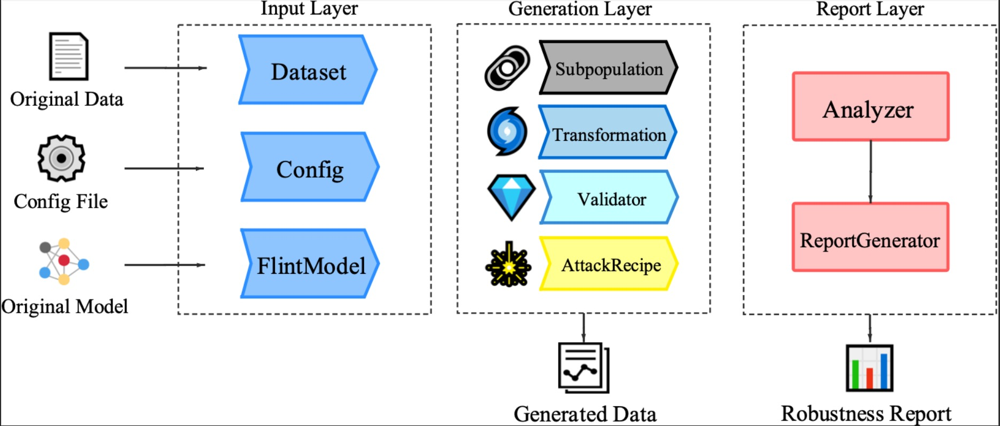

<p align="center"></p>

<p align="center">Unified Multilingual Robustness Evaluation Toolkit 
    for Natural Language Processing</p>
<p align="center">
  <a href="https://textflint.readthedocs.io/">[TextFlint Documentation on ReadTheDocs]</a>
  <br> <br>
  <a href="#about">About</a> •
  <a href="#setup">Setup</a> •
  <a href="#usage">Usage</a> •
  <a href="#design">Design</a> 
  <br> <br>
  <a href="https://github.com/textflint/textflint/actions/workflows/python-package.yml">
    
  </a>
  <a href="https://badge.fury.io/py/textflint">
    
  </a>
</p>


## About


TextFlint is a multilingual robustness evaluation platform for natural language processing tasks, which unifies general text transformation, task-specific transformation, adversarial attack, sub-population, and their combinations to provide a comprehensive robustness analysis. This repository contains the code for our paper [TextFlint: Unified Multilingual Robustness Evaluation Toolkit for Natural Language Processing](https://arxiv.org/pdf/2103.11441.pdf).


### Features:

There are lots of reasons to use TextFlint:

- **Full coverage of transformation types**, including 20 general transformations, 8 subpopulations and 60 task-specific transformations, as well as thousands of their combinations, which basically covers all aspects of text transformations to comprehensively evaluate the robustness of your model. TextFlint also supports **Subpopulation** and **Adversarial Attack** to generate model specific transformed datas.
- **Generate targeted augmented data**, and you can use the additional data to train or fine-tune your model to improve your model's robustness.
- **Provide a complete analytical report automatically** to accurately explain where your model's shortcomings are, such as the problems in lexical rules or syntactic rules. 

## Setup

### Installation

**Require python version >= 3.7, recommend install with `pip` (recommended)**

```shell
pip install textflint
```


## Usage
### Workflow


The general workflow of TextFlint is displayed above. Evaluation of target models could be divided into three steps:

1. For input preparation, the original dataset for testing, which is to be loaded by `Dataset`, should be firstly formatted as a series of `JSON` objects. You can use the build `Dataset` following this [instruction](docs/source/components/4_Sample_Dataset.ipynb). TextFlint configuration is specified by `Config`. Target model is also loaded as `FlintModel`. 
2. In adversarial sample generation, multi-perspective transformations (i.e., [80+Transformation](docs/source/components/transformation.md), [Subpopulation](docs/source/components/subpopulation.md) and `AttackRecipe`), are performed on `Dataset` to generate transformed samples. Besides, to ensure semantic and grammatical correctness of transformed samples, `Validator` calculates confidence of each sample to filter out unacceptable samples. 
3. Lastly, `Analyzer` collects evaluation results and `ReportGenerator` automatically generates a comprehensive report of model robustness. 

We release tutorials of performing the whole pipeline of TextFlint on various tasks, including:

* [Machine Reading Comprehension](docs/source/tutorials/9_MRC.ipynb)
* [POS tagging](docs/source/tutorials/7_BERT%20for%20POS%20tagging.ipynb)
* [Named Entity Recognition](docs/source/tutorials/11_NER.ipynb) 
* [Chinese Word Segmentation](docs/source/tutorials/10_CWS.ipynb).

### Quick Start

Using TextFlint to verify the robustness of a specific model is as simple as running the following command:

```shell
$ textflint --dataset input_file --config config.json
```

where *input\_file* is the input file of csv or json format, *config.json* is a configuration file with generation and target model options. Take the configuration for **TextCNN** model on SA task as example:

```json
{
  "task": "SA",
  "out_dir": "./DATA/",
  "trans_methods": [
    "Ocr",
    ["InsertAdv", "SwapNamedEnt"],   
    ...
  ],
  "trans_config": {
    "Ocr": {"trans_p": 0.3},
    ...
  },
...
}
```

- *task* is the name of target task. 

- *out\_dir* is the directory where each of the generated sample and its corresponding original sample are saved.

- *flint\_model* is the python file path that saves the instance of FlintModel.

- *trans\_methods* is used to specify the transformation method. For example, *"Ocr"* denotes the universal transformation **Ocr**,  and *["InsertAdv", "SwapNamedEnt"]* denotes a pipeline of task-specific transformations, namely **InsertAdv** and **SwapNamedEnt**.

- *trans\_config* configures the parameters for the transformation methods. The default parameter is also a good choice. 

Based on the design of decoupling sample generation and model verification, **TextFlint** can be used inside another NLP project with just a few lines of code.

```python
from textflint import Engine

data_path = 'input.json'
config = 'config.json'
engine = Engine()
engine.run(data_path, config)
```


####  Transformed Datasets

After transformation, here are the contents in `./DATA/`:

```
ori_Keyboard_2.json
ori_SwapNamedEnt_1.json
trans_Keyboard_2.json
trans_SwapNamedEnt_1.json
...
```

where the `trans_Keyboard_2.json`  contains `2` successfully transformed sample by transformation `Keyboard` and `ori_Keyboard_2.json` contains the corresponding original sample. The content in `ori_Keyboard_2.json`: 

```
{"x": "Titanic is my favorite movie.", "y": "pos", "sample_id": 0}
{"x": "I don't like the actor Tim Hill", "y": "neg", "sample_id": 1}
```
The content in `trans_Keyboard_2.json`:
```
{"x": "Titanic is my favorite m0vie.", "y": "pos", "sample_id": 0}
{"x": "I don't likR the actor Tim Hill", "y": "neg", "sample_id": 1}
```

## Design



### Architecture

***Input layer:*** receives textual datasets and models as input, represented as `Dataset` and `FlintModel` separately.

- **`DataSet`**: a container for `Sample`, provides efficiently and handily operation interfaces for `Sample`. `Dataset` supports loading, verification, and saving data in Json or CSV format for various NLP tasks. 
- **`FlintModel`**: a target model used in an adversarial attack.

 ***Generation layer:***  there are mainly four parts in generation layer:

- **`Subpopulation`**: generates a subset of a `DataSet`. 
- **`Transformation`**: transforms each sample of `Dataset` if it can be transformed. 
- **`AttackRecipe`**: attacks the `FlintModel` and generate a `DataSet` of adversarial examples.
- **`Validator`**: verifies the quality of samples generated by `Transformation` and `AttackRecipe`.

***Report layer:*** analyzes model testing results and provides robustness report for users.

### AttackRecipe

`AttackRecipe` aims to find a perturbation of an input text satisfies the attack's goal to fool the given `FlintModel`. In contrast to `Transformation`, `AttackRecipe` requires the prediction scores of the target model.  textflint provides an interface to integrate the easy-to-use adversarial attack recipes implemented based on `textattack`. Users can refer to [textattack](https://github.com/QData/TextAttack) for more information about the supported `AttackRecipe`.

### Validator

It is crucial to verify the quality of samples generated by `Transformation` and `AttackRecipe`. TextFlint provides several metrics to calculate confidence:

<table style="width:100%" border="2">
<thead>
  <tr>
    <th>Validator</th>
    <th>Description</th>
    <th>Reference</th>
  </tr>
</thead>
<tbody>
  <tr>
      <td><code>MaxWordsPerturbed</code></td>
      <td><sub>Word replacement ratio in the generated text compared with the original text based on LCS.</sub></td>
    <td>-</td>
  </tr>
  <tr>
      <td><code>LevenshteinDistance</code></td>
      <td><sub>The edit distance between original text and generated text</sub></td>
    <td>-</td>
  </tr>
  <tr>
      <td><code>DeCLUTREncoder</code></td>
      <td><sub>Semantic similarity calculated based on Universal Sentence Encoder</sub></td>
      <td><sub>Universal sentence encoder (https://arxiv.org/pdf/1803.11175.pdf)</sub></td>
  </tr>
  <tr>
      <td><code>GPT2Perplexity</code></td>
      <td><sub>Language model perplexity calculated based on the GPT2 model</sub></td>
      <td><sub>Language models are unsupervised multitask learners (http://www.persagen.com/files/misc/radford2019language.pdf)</sub></td>
  </tr>
  <tr>
      <td><code>TranslateScore</code></td>
      <td><sub>BLEU/METEOR/chrF score</sub></td>
      <td><sub>Bleu: a method for automatic evaluation of machine translation (https://www.aclweb.org/anthology/P02-1040.pdf)<br>METEOR: An automatic metric for MT evaluation with improved correlation with human judgments (https://www.aclweb.org/anthology/W05-0909.pdf)<br>chrF: character n-gram F-score for automatic MT evaluation (https://www.aclweb.org/anthology/W15-3049.pdf)</sub></td>
  </tr>
</tbody>
</table>

### Report

In Generation Layer, TextFlint can generate three types of adversarial samples and verify the robustness of the target model. Based on the results from Generation Layer, Report Layer aims to provide users with a standard analysis report from lexics, syntax, and semantic levels. For example, on the Sentiment Analysis (SA) task, this is a statistical chart of the performance of`XLNET`  with different types of `Transformation`/`Subpopulation`/`AttackRecipe` on the `IMDB` dataset. We can find that the model performance is lower than the original results in all the transformed dataset.


## Citation

If you are using TextFlint for your work, please cite:

```latex
@article{gui2021textflint,
  title={TextFlint: Unified Multilingual Robustness Evaluation Toolkit for Natural Language Processing},
  author={Gui, Tao and Wang, Xiao and Zhang, Qi and Liu, Qin and Zou, Yicheng and Zhou, Xin and Zheng, Rui and Zhang, Chong and Wu, Qinzhuo and Ye, Jiacheng and others},
  journal={arXiv preprint arXiv:2103.11441},
  year={2021}
}
```
